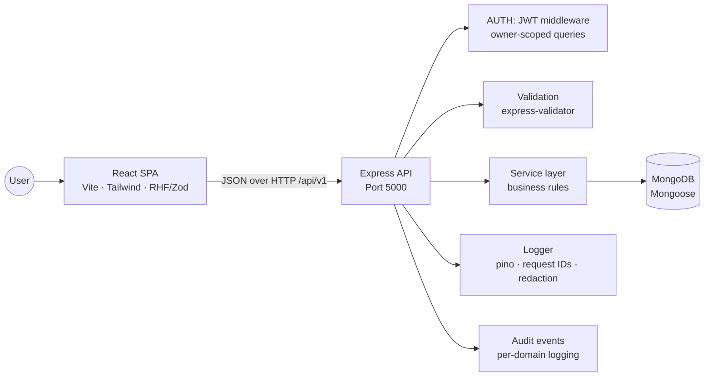
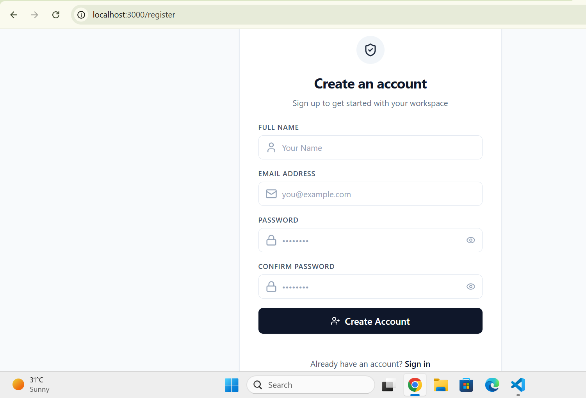
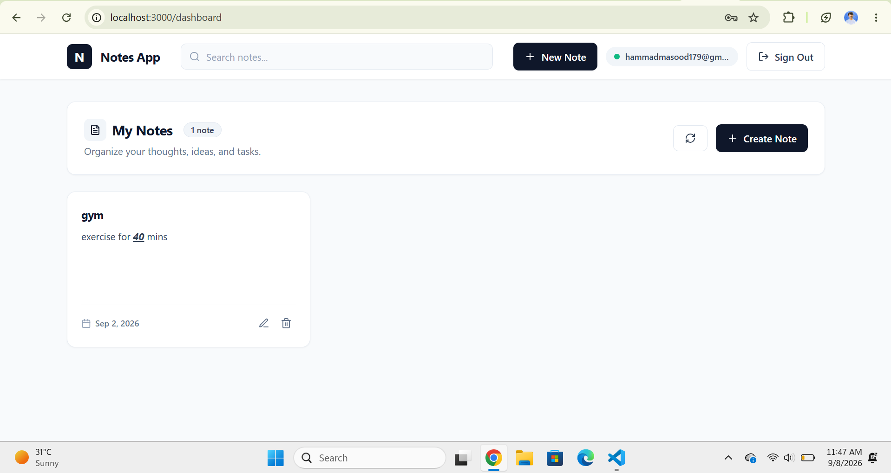
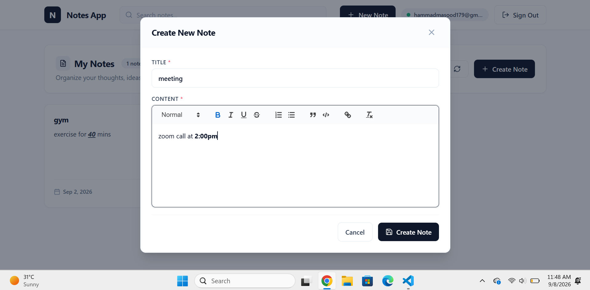

# Notes App — Full-Stack MERN Application (10p shine Internship task)

> Cohort 9 — MERN (Node.js + React.js) assignment by **Hammad Masood**

A secure, full-stack **personal notes manager**. The application provides JWT-based
authentication and lets each user create, organize, edit, search, and delete their
own rich-text notes. It is built with a layered Express + MongoDB API and a
React + Vite single-page client, and ships with unit & integration tests, code
coverage reporting, and SonarQube quality-gate configuration.


---

## Table of Contents

- [Project Overview](#project-overview)
- [Features](#features)
- [Architecture](#architecture)
- [Folder Structure](#folder-structure)
- [Installation](#installation)
- [Environment Variables](#environment-variables)
- [API Documentation](#api-documentation)
- [Testing](#testing)
- [Deployment](#deployment)
- [Screenshots](#screenshots)
- [Future Improvements](#future-improvements)

---

## Project Overview

**Notes** is a production-shaped MERN (MongoDB, Express, React, Node.js) assignment
that demonstrates a clean, layered, and testable web application.

- **Frontend** — React 18, Vite, React Router, Tailwind CSS, React Hook Form +
  Zod validation, React Quill (rich-text editing), Axios.
- **Backend** — Express 5, Mongoose 9 (MongoDB), JWT authentication, bcrypt
  password hashing, `express-validator`, and structured `pino` logging with
  request IDs and secret redaction.
- **Quality** — Mocha/Chai/Sinon/Supertest unit + integration tests with `nyc`
  coverage for the backend; Jest + React Testing Library for the frontend;
  SonarQube and CodeRabbit configuration included.

Each user sees only their own notes. Ownership is enforced on **every** data
access, and the API is designed so cross-account reads are indistinguishable
from "not found", making it safe against id-probing.

---

## Features

### Authentication & Security
- **Register / Login** with email + password.
- **JWT bearer tokens** — signed with only `sub` (user id) and `role`, so a
  profile edit never leaves a stale payload behind.
- **bcrypt password hashing** with configurable salt rounds; passwords are
  `select: false` by default so they can never leak from a stray query.
- **Session restore** — `GET /auth/me` validates an existing token on page load.
- **401 handling** — the client clears the session and redirects on an expired
  or invalid token.
- **Unified email enumeration protection** — login reports the same error whether
  the email is unknown or the password is wrong.
- **Role field** (`user` / `admin`) with an `authorize(...roles)` middleware for
  role-based access control.
- **Body size limits** and centralized translation of framework errors
  (validation, duplicate keys, cast errors, malformed JSON, DB outages) into one
  consistent error shape.

### Notes Management (Dashboard)
- Create, read, update, and delete notes with a **rich-text editor** (headings,
  lists, quotes, code blocks, links).
- **Live client-side search** across note titles and content.
- **Per-user data isolation** — every query filters by owner and id.
- Responsive card grid with note count, loading skeletons, empty states, and
  toast notifications for actions.
- Delete confirmation modal; edit modal pre-filled with existing content.

### Observability
- **Structured JSON logging** via `pino` (colorized pretty-printing in dev).
- **Request IDs** propagated end-to-end and echoed back to clients on errors.
- **Sensitive-field redaction** (passwords, tokens, authorization headers) before
  anything is written to the log.
- **Per-domain audit events** (`auth.login`, `note.create`, …) recording who did
  what, to which record, and whether it succeeded.

### Developer Experience & Quality
- Hot-reload dev servers (`nodemon` + Vite proxy).
- Guarded, layered codebase with input validation and async error handling.
- Unit + integration test suites with coverage reports on both sides.
- SonarQube `sonar-project.properties` and `.coderabbit.yaml` AI-review config.

---

## Architecture

The repository is a **monorepo with two independent applications** under
`backend/` and `frontend/`. They communicate over a JSON REST API.



### Backend layers

The Express API follows a strict **route → controller → service → model**
separation, plus a middleware chain:

1. **`httpLogger`** (first) assigns a request ID and logs each request/response.
2. **CORS & body parsing** with size limits.
3. **Route handlers** apply validators, the `validate` result checker, and the
   `audit` decorator; protected routes sit behind `authenticate` (JWT) middleware.
4. **Controllers** stay thin — they parse `req`, call a service, and shape the
   JSON response.
5. **Services** hold business rules (duplicate-email checks, ownership scoping,
   the "nothing to update" guard).
6. **Models** (Mongoose) own schema rules, indexes, and the password-hash hook.
7. **Error middleware** (last) converts every failure into a uniform
   `{ success: false, message, errors?, requestId? }` response and logs 5xx as
   errors, 4xx as warnings.

### Frontend structure

React Router guards public (`/login`, `/register`) and protected (`/dashboard`)
routes. An `AuthProvider` context owns the session, bootstraps it from
localStorage, re-validates it against `/auth/me`, and reacts to global
`auth:unauthorized` events raised by the Axios response interceptor.

---

## Folder Structure

```text
.
├── backend/                      # Express REST API
│   ├── index.js                  # Entry point — boot + graceful shutdown
│   ├── src/
│   │   ├── app.js                # Express app assembly & middleware wiring
│   │   ├── config/
│   │   │   ├── env.js            # Env loading & validation
│   │   │   ├── db.js             # Mongoose connection lifecycle
│   │   │   └── logger.js         # pino logger (redaction, serializers)
│   │   ├── controllers/          # auth.controller.js, note.controller.js
│   │   ├── middleware/
│   │   │   ├── auth.middleware.js# authenticate (JWT) & authorize (RBAC)
│   │   │   ├── audit.middleware.js# per-route domain-event logging
│   │   │   ├── error.middleware.js# not-found + centralized error handler
│   │   │   ├── logger.middleware.js# pino-http request logging
│   │   │   └── validate.js       # express-validator result reporter
│   │   ├── models/               # user.model.js, note.model.js
│   │   ├── routes/               # index.js, auth.routes.js, note.routes.js
│   │   ├── services/             # auth.service.js, note.service.js
│   │   ├── utils/                # ApiError, asyncHandler, jwt
│   │   └── validators/           # auth.validator.js, note.validator.js
│   └── tests/
│       ├── unit/                 # controllers, middleware, services
│       └── integration/          # routes.test.js (supertest)
│
├── frontend/                     # React SPA
│   ├── index.html
│   ├── vite.config.js            # Dev server on :3000, proxies /api → :5000
│   ├── jest.config.cjs
│   ├── src/
│   │   ├── main.jsx              # React bootstrap
│   │   ├── App.jsx               # Router + route guards
│   │   ├── api/                  # axios client, auth.api.js, notes.api.js
│   │   ├── components/
│   │   │   ├── dashboard/        # Navbar, NotesGrid, NoteCard, NoteModal,
│   │   │   │                     # RichTextEditor, SearchBar, DeleteConfirmModal,
│   │   │   │                     # LoadingState, EmptyState
│   │   │   ├── routes/           # ProtectedRoute, PublicRoute
│   │   │   └── ui/               # Alert, Input
│   │   ├── context/AuthContext.jsx
│   │   ├── hooks/useAuth.js
│   │   ├── pages/                # Login, Register, Dashboard
│   │   ├── utils/                # textUtils.js
│   │   ├── validators/           # auth.schema.js (Zod)
│   │   └── __tests__/            # Jest + RTL suites
│   │
├── sonar-project.properties      # SonarQube scan configuration
├── .coderabbit.yaml              # CodeRabbit AI review rules
└── README.md
```

---

## Installation

### Prerequisites

- **Node.js** 18 or later (backend uses Express 5 / Mongoose 9; frontend uses Vite 5)
- **npm**
- **MongoDB** — a local instance or a connection string (e.g. MongoDB Atlas)

### 1. Clone and install

```bash
git clone https://github.com/hammad-masood26/cohort-9-mern-14766-hammad.git
cd cohort-9-mern-14766-hammad

# Backend
cd backend
npm install

# Frontend
cd ../frontend
npm install
```

### 2. Configure environment

Backend — copy the template and fill in your values:

```bash
cd backend
cp .env.example .env
```

At minimum, set a real `MONGODB_URI` and a long random `JWT_SECRET`
(the server refuses to boot without them).

Generate a secret with:

```bash
node -e "console.log(require('crypto').randomBytes(48).toString('hex'))"
```

The frontend needs **no** `.env` for local development: Vite proxies `/api`
requests to `http://localhost:5000` automatically (see `vite.config.js`). Set
`VITE_API_BASE_URL` only when you point the built app at a remote API (see
[Deployment](#deployment)).

### 3. Run locally

```bash
# Terminal 1 — backend API at http://localhost:5000
cd backend
npm run dev

# Terminal 2 — frontend at http://localhost:3000
cd frontend
npm run dev
```

Open http://localhost:3000, register an account, and start taking notes.

---

## Environment Variables

### Backend (`backend/.env`)

| Variable            | Default                              | Description                                                                  |
| ------------------- | ------------------------------------ | ---------------------------------------------------------------------------- |
| `NODE_ENV`          | `development`                        | Runtime environment (`development` / `production` / `test`).                 |
| `PORT`              | `5000`                               | Port the API listens on.                                                     |
| `MONGODB_URI`       | *(required)*                         | MongoDB connection string. **Server will not start without it.**             |
| `JWT_SECRET`        | *(required)*                         | Secret used to sign/verify JWTs. **Server will not start without it.**       |
| `JWT_EXPIRES_IN`    | `1d`                                 | Token lifetime (e.g. `15m`, `7d`).                                           |
| `BCRYPT_SALT_ROUNDS`| `10`                                 | bcrypt hashing cost.                                                         |
| `CORS_ORIGIN`       | `*`                                  | Allowed CORS origin(s). Comma-separate for a list.                           |
| `LOG_LEVEL`         | `debug` (dev) / `info` (production)  | pino level: `fatal,error,warn,info,debug,trace,silent`.                      |

### Frontend (`frontend/.env`)

| Variable              | Default   | Description                                                    |
| --------------------- | --------- | -------------------------------------------------------------- |
| `VITE_API_BASE_URL`   | `/api/v1` | Base URL of the API. Required only when not using the Vite dev proxy. |

---

## API Documentation

**Base URL:** `http://localhost:5000/api/v1`

**Auth:** protected endpoints expect a header — `Authorization: Bearer <token>`
(the token is returned by `register` and `login`).

**Response envelope** — every successful response follows this shape:

```json
{
  "success": true,
  "message": "…",
  "data": { }
}
```

**Error envelope:**

```json
{
  "success": false,
  "message": "…",
  "errors": [{ "field": "email", "message": "…" }],
  "requestId": "…"
}
```

### Endpoint summary

| Method | Endpoint             | Auth   | Description                                 |
| ------ | -------------------- | ------ | ------------------------------------------- |
| GET    | `/health`            | —      | Health check.                               |
| POST   | `/auth/register`     | —      | Create an account, returns user + JWT.      |
| POST   | `/auth/login`        | —      | Log in, returns user + JWT.                 |
| GET    | `/auth/me`           | ✅     | Current profile (used to restore sessions). |
| POST   | `/notes`             | ✅     | Create a note.                              |
| GET    | `/notes`             | ✅     | List the caller's notes (newest first).     |
| GET    | `/notes/:id`         | ✅     | Get one note (owner only).                  |
| PATCH  | `/notes/:id`         | ✅     | Update title and/or content.                |
| DELETE | `/notes/:id`         | ✅     | Delete a note (owner only).                 |

### Authentication

#### `POST /api/v1/auth/register` — Create an account

**Request body:**

| Field      | Type     | Rules                                                           |
| ---------- | -------- | --------------------------------------------------------------- |
| `name`     | `string` | required, 2–50 characters.                                      |
| `email`    | `string` | required, valid email, unique.                                  |
| `password` | `string` | required, 8–72 characters, at least one lowercase, one uppercase, and one number. |

**Example — `201 Created`:**

```json
{
  "success": true,
  "message": "Account created successfully",
  "data": {
    "user": { "id": "…", "name": "Ada", "email": "ada@example.com", "role": "user" },
    "token": "<jwt>"
  }
}
```

#### `POST /api/v1/auth/login` — Log in

**Request body:** `{ "email": "string", "password": "string" }`

**Responses:** `200 OK` with the same `{ user, token }` shape as register;
`401` with `"Invalid email or password"` for a bad credential (identical for an
unknown email and a wrong password).

#### `GET /api/v1/auth/me` — Current profile *(auth)*

**Example — `200 OK`:**

```json
{
  "success": true,
  "message": "Profile retrieved successfully",
  "data": { "user": { "id": "…", "name": "Ada", "email": "ada@example.com", "role": "user" } }
}
```

### Notes *(all endpoints require auth)*

#### `POST /api/v1/notes` — Create a note

**Request body:**

| Field     | Type     | Rules                    |
| --------- | -------- | ------------------------ |
| `title`   | `string` | required, ≤ 120 characters. |
| `content` | `string` | required, ≤ 10,000 characters (may be HTML from the rich-text editor). |

**Example — `201 Created`:**

```json
{
  "success": true,
  "message": "Note created successfully",
  "data": {
    "note": { "id": "…", "title": "Groceries", "content": "<p>Milk and eggs</p>", "createdAt": "…", "updatedAt": "…" }
  }
}
```

#### `GET /api/v1/notes` — List notes

Returns the caller's notes sorted newest-first:

```json
{
  "success": true,
  "message": "Notes retrieved successfully",
  "data": { "notes": [ "…" ], "count": 0 }
}
```

#### `GET /api/v1/notes/:id` — Get one note

Returns `200` with `data.note`, or `404` if the note does not exist or belongs
to another user (the two cases are intentionally indistinguishable).

#### `PATCH /api/v1/notes/:id` — Update a note

Both `title` and `content` are optional, but at least one is required — sending
neither returns `422`. Supports partial updates.

#### `DELETE /api/v1/notes/:id` — Delete a note

**Example — `200 OK`:**

```json
{ "success": true, "message": "Note deleted successfully" }
```

### Common status codes

| Code | Meaning                                                        |
| ---- | -------------------------------------------------------------- |
| `400`| Invalid value (e.g. malformed id) or malformed JSON body.      |
| `401`| Missing/expired/invalid token, or bad credentials.             |
| `403`| Authenticated but not authorized for the role.                 |
| `404`| Route or resource not found.                                   |
| `409`| Conflict — email already registered.                           |
| `413`| Request body too large.                                        |
| `422`| Validation failed — details in `errors`.                       |
| `503`| Database temporarily unavailable.                              |

---

## Testing

### Backend — Mocha + Chai + Supertest + Sinon

```bash
cd backend

npm test                 # run unit & integration tests
npm run test:coverage    # run tests with nyc coverage (text + HTML report)
```

- Unit tests cover controllers, middleware, and services (mocked dependencies).
- Integration tests exercise the full HTTP stack via Supertest.
- Coverage is written to `backend/coverage/`.

### Frontend — Jest + React Testing Library

```bash
cd frontend

npm test          # run all Jest suites
npm test -- --coverage    # run with coverage report
```

Suites cover the Axios API layer, auth forms, the dashboard flow, the note
modal, and route guards. Coverage is written to `frontend/coverage/`.

### Static analysis

A SonarQube configuration is included — [`sonar-project.properties`](sonar-project.properties)
defines the project key, source/test directories, exclusions, and coverage
report paths (`backend/coverage/lcov.info`, `frontend/coverage/lcov.info`).
Generate the LCOV reports first, then run the SonarQube scanner from the
repository root.

---

## Deployment

The two applications deploy independently; the only requirement is that the
frontend can reach the API over HTTPS.

### 1. Database — MongoDB Atlas

Create a free cluster, then set `MONGODB_URI` on the backend host.

### 2. Backend API

**Option A — Render / Railway / Fly.io**

- Root directory: `backend`
- Build command: `npm install`
- Start command: `npm start`
- Add the environment variables from the table above (never commit `.env`).

**Option B — any Node host / container**

```bash
cd backend
npm install --omit=dev   # pino-pretty is a devDependency — production logs JSON to stdout
npm start                # or npm run start
```

The API listens on `PORT` (default `5000`) and expects `NODE_ENV=production`.

### 3. Frontend — static hosting (Vercel / Netlify / GitHub Pages)

```bash
cd frontend
npm install
npm run build            # outputs static assets to frontend/dist
```

- Publish the `frontend/dist/` directory.
- Set `VITE_API_BASE_URL` to the **full public API URL**
  (e.g. `https://your-api.onrender.com/api/v1`) **before** building, since Vite
  inlines env vars at build time:

```bash
# Windows PowerShell
$env:VITE_API_BASE_URL = "https://your-api.onrender.com/api/v1"; npm run build

# macOS / Linux / Git Bash
VITE_API_BASE_URL="https://your-api.onrender.com/api/v1" npm run build
```

- In production, set `CORS_ORIGIN` on the backend to your frontend domain
  (not `*`) and keep `NODE_ENV=production`.

### Checklist before shipping

- [ ] `JWT_SECRET` is a long, random, generated value — never the template value.
- [ ] `CORS_ORIGIN` is locked to your frontend domain.
- [ ] `NODE_ENV=production` (enables JSON stdout logging, disables stack traces
      in error responses).
- [ ] MongoDB is backed up and access is restricted to the API host.

---

## Screenshots

> The application screenshots live in [`screenshots/`](screenshots/).

### Register page



### Dashboard



### Rich-text note editor



---

## Future Improvements

The project is intentionally scoped to a single-user-per-account notes manager.
Natural next steps include:

- **Security & auth**
  - Refresh-token rotation + token revocation for true sign-out.
  - Password reset / email verification via transactional email.
  - Rate limiting and lockout on auth endpoints.
- **Notes & data**
  - Server-side pagination and search (indexed on the DB instead of in-memory).
  - Tags, pinning, archiving, and soft-delete with trash.
  - Note version history and undo.
- **Collaboration**
  - Note sharing and multi-user collaboration.
  - Admin dashboard to manage users and roles end-to-end (the `role` field and
    `authorize` middleware already exist as a foundation).
- **UX & platform**
  - Dark mode and note templates.
  - Image/file attachments inside the rich-text editor.
  - Dockerfiles + `docker-compose` for a one-command local stack.
  - CI pipeline (GitHub Actions) wiring test + coverage runs straight into the
    SonarQube quality gate.
- **Observability**
  - Request tracing across services and structured audit-log export.

---

## License

ISC — see the backend `package.json`. This project was created as a Cohort 9
MERN assignment.

---

**Author:** [Hammad Masood](https://github.com/hammad-masood26)
